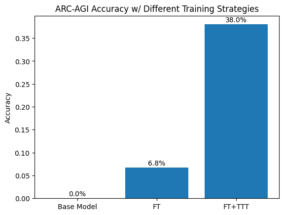
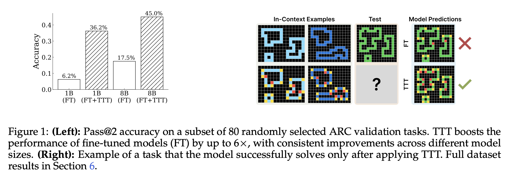
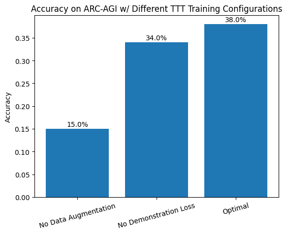
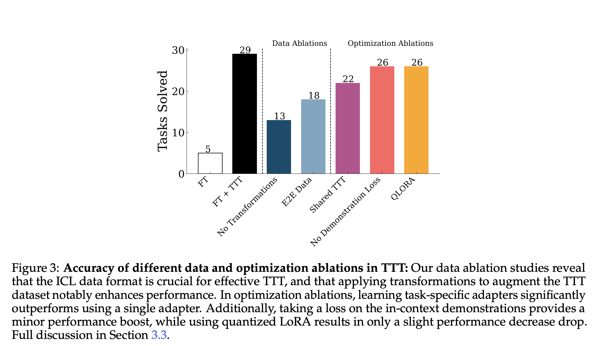
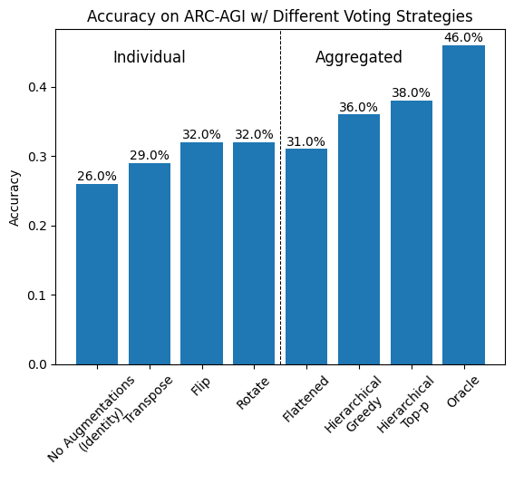
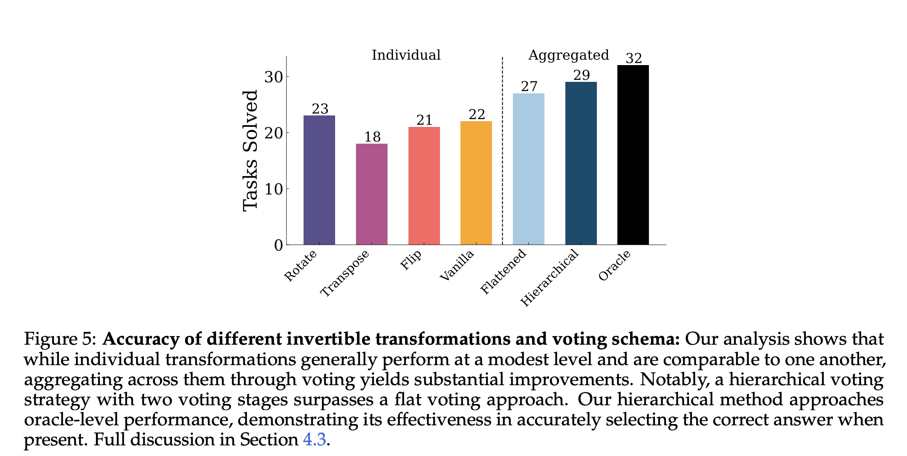

# Final Report

Original paper: [https://arxiv.org/abs/2411.07279](https://arxiv.org/abs/2411.07279)

Paper code: [https://github.com/ekinakyurek/marc/tree/95b334872d435d5639135b32039577e2853a706b](https://github.com/ekinakyurek/marc/tree/95b334872d435d5639135b32039577e2853a706b)

## Resource Usage
- With our settings, the three TTT training runs take 220 minutes total on a single H100 GPU.
- Inference takes 10 minutes for 100 problems, and we did 6 inference runs (1 hour of GPU time).
- This replication took ~5 hours of H100 GPU time, and ~2 hours of serial GPU time across three GPUs.

## Replication Notes
Here, we provide important notes on our replication and ways that our task/replication differs from the original paper or it's code.

- Only ran experiments on 1B model (instead of 1B, 3B, and especially 8B) to save on GPU time. This is true across all experiments.
- Do all plots with pass@2 metric (instead of a mix of pass@1 and pass@2 as in the original paper). We do this to get better signal since we are using a smaller 1B model than in the original paper.
- Only do TTT training for 1 epoch instead of 2 to save on GPU time. We want a fair comparison with compute-constrained agent runs.
- We used a fix set of the first 100 problems for TTT rather than 80, as they used in the original paper.
- Only reproduce a subset of the results in the paper (and we add a few extra baselines/ablations):
    - No initial finetuning. We start with the finetuned model checkpoint and only tune the TTT adapters (no Figure 7 finetuning results)
    - Figure 1 on overall performance: Also add the base (non-FT) model to the plot for an extra cheap comparison point.
    - Figure 3 on TTT training ablations: Only ask for three versions of TTT training strategies for ablations: TTT without data augmentation, TTT without demonstration loss, and the full TTT setup from the paper
    - Figure 5 on voting/aggregation ablations: this is a full replication of all ablation settings
    - No Table 1 BARC results

To download trained models and adapters: `cd marc && bash download_artifacts.sh`
To run TTT training: `cd marc && bash ttt.sh`
To run inference: `cd marc && bash inference.sh`
To do voting/scoring: use the `plots.ipynb` notebook in the `marc` directory.

We provide a patch file in `changes.patch` that shows the changes we made to the [original codebase](https://github.com/ekinakyurek/marc/tree/95b334872d435d5639135b32039577e2853a706b).

## Target Results

Note: All results use pass@2 accuracy.

### 1. Final Performance Comparison

**Figure 1.** Results closely match the 1B model results from the original paper. The base model performs very poorly, the model finetuned on ARC traces does better, but the TTT model substantially outperforms both.

**Reference - Figure 1 in the original ARC TTT paper.** We achieve a slightly higher accuracy than the original paper because we also include a top-p sampling version of the final setup, which outperforms greedy sampling for us, which also gets 36% accuracy like in the original paper.

### 2. Algorithmic Design Space Exploration

#### A. Test-Time Data and Optimization

**Figure 2.** We run ablations on TTT training configurations. Data augmentation is the most important component, as it greatly increases the size of the TTT training set (removing it reduces performance by over 50%). Replacing loss over the in-context examples with a test-sample only loss also results in a reducation in performance (4%).

**Reference - Figure 3 in the original ARC TTT paper.** We use a 1B model with pass@2 instead of an 8B model with pass@1, however the relative performance of TTT ablations is similar. Our "No Data Augmentation" nearly matches their "No Transformations" results. Our "No Demonstration Loss" ablations performs 4% worse than our optimal setup compared to their 3% gap.

#### B. Test-Time Sampling and Aggregation 

**Figure 3.** We run ablations on test-time sampling and aggregation strategies. Here, we take the already trained TTT model (which uses all data augmentations for training) and test it first with using only one type of augmentation (left) and using majority voting on the resulting outputs (use greedy sampling, the multiple outputs come from e.g. multiple rotation angles, horizontal and vertical flips, etc.). We also evaluate using flattened vs hierarchical voting across all data augmentation types (described in the paper), where we see that hierarchical voting across types does significantly better than flattened or single-type voting. Lastly, we find that top-p with $p=0.9$ does slightly better than greedy sampling (although only when combined with hierarchical voting). All voting methods fall considerably short of Oracle performance (where the model is correct if any generated output is correct). However, the voting methods close the gap by $\geq 1/2$ compared to Vanilla/Identity greedy sampling.

**Reference - Figure 5 in the original ARC TTT paper.** We observe slightly different numbers in our 1B pass@2 setting, but similar overall relationships between voting methods. Using a single data augmentation method or flattened voting underperforms hierarchical voting by 5-10%, and oracle mode has a sizable improvement over voting methods. There are some minor variations in results, such as flattened voting not outperforming single data augmentation methods, although it is only beaten by Flip and Rotate (which have several parameters and thus give more samples to vote on and use for pass@2 sampling, which is unique to our setting). And the gap between oracle and voting methods is slightly larger in our setting, which may be a consequence of using a smaller model.
