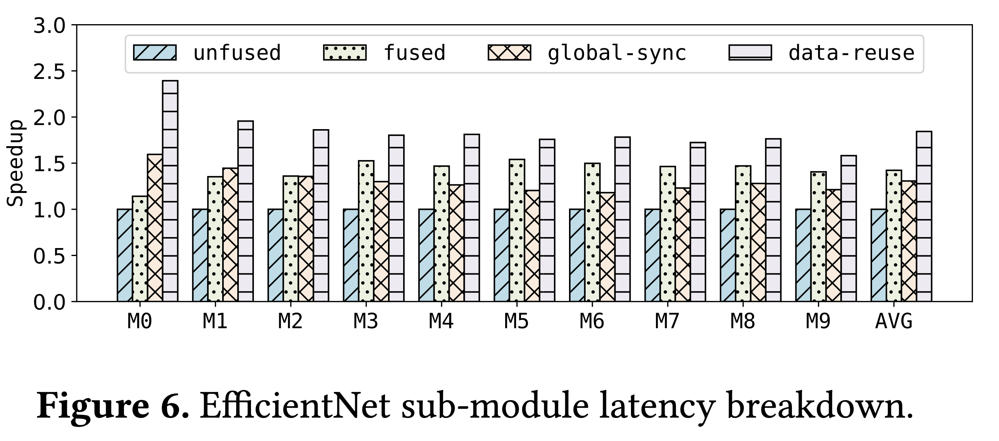

# Final Report

Original paper: [https://dl.acm.org/doi/10.1145/3617232.3624858](https://dl.acm.org/doi/10.1145/3617232.3624858)

Paper code: [https://github.com/summerspringwei/souffle-ae/tree/cf210092fd4b3bcadee2f93ffb4c08e8efdfc106](https://github.com/summerspringwei/souffle-ae/tree/cf210092fd4b3bcadee2f93ffb4c08e8efdfc106)

## Resource Usage
- Running the entire replication code takes ~2 hours, mostly due to Apollo and Souffle compilation time.

## Replication Notes
Here, we provide important notes on our replication and ways that our task/replication differs from the original paper or it's code.

### Task Differences
- We excluded Figure 1 (BERT kernel launches and memory loads) and Table 6 (LSTM memory load and pipelining) from our replication because the original codebase lacked reference implementations for these analyses. Note that Table 5 already provides similar kernel launch and memory load metrics across multiple models, effectively covering the information presented in Figure 1.

### Replication Differences from the Original Codebase
No major differences! Our work mainly involved cleaning up paths, minor naming and formatting bugs, and fixing some broken build instructions.
- Note that the original codebase SwinTransformer Souffle implementation didn't compile properly, leading to missing results in Table 3, 4, and 5.
- We omit the TensorXLA and Ansor baselines in Table 3, since the codebase lacked working reference implementations for these baselines for end-to-end latency
- We also omit the TensorRT kernel launch results in Table 5 because the kernel launch measurement script for TensorRT was broken in the original codebase.

### Running the Code
We use a docker-in-docker setup (tensor compilers are run within their own inner dockers). To build the inner dockers after opening a bash shell in the outer docker: `cd souffle-ae && bash scripts/build_all_dockers.sh`

Set your host machine's CUDA_VISIBLE_DEVICES environment variable to the GPU index you want to use.

To run table 3 results: `cd souffle-ae && bash scripts/run_table3.sh` and see results in `souffle-ae/results/table3.csv`

To run table 4 results: `cd souffle-ae && bash scripts/run_table4.sh` and see results in `souffle-ae/results/table4.csv`

To run table 5 results: `cd souffle-ae && bash scripts/run_table5.sh` and see results in `souffle-ae/results/table5.csv`

To run figure 6 results: `cd souffle-ae && bash scripts/run_figure6.sh` and see results in `souffle-ae/results/efficientnet-se-module-latency-ours.png`

See tables and figures in `souffle-ae/results` and final versions in `souffle-ae/plots.ipynb`

We provide a patch file in `changes.patch` that shows the changes we made to the [original codebase](https://github.com/summerspringwei/souffle-ae/tree/cf210092fd4b3bcadee2f93ffb4c08e8efdfc106).

## Target Results

Here we provide our results alongside reference comparisons to figures and tables in the original Souffle paper.

### 1. End-to-End Execution Time

| Model        |   TensorRT: | Rammer:   | Apollo:   |   IREE: | Souffle:   |
|:-------------|------------:|:----------|:----------|--------:|:-----------|
| BERT         |       2.191 | 2.372     | 6.025     |  24.657 | **1.336**      |
| ResNeXt      |      24.823 | 11.609    | 18.315    | 295.722 | **5.802**      |
| LSTM         |       8.567 | 18.368    | failed    |  10.204 | **0.857**      |
| EfficientNet |       1.197 | failed    | 2.287     |   6.034 | **0.767**      |
| SwinTrans    |       2.237 | failed    | 14.335    |  27.934 | failed     |
| MMoE         |       0.077 | failed    | 0.062     |   0.057 | **0.026**      |

**Table 1.** End-to-end latency of a single forward pass with batch size 1 for all models and inference pipelines. Souffle outperforms all other baselines. Most other baselines have at least one model where performs is very slow, while Souffle consistently performs well across models. No single baseline is dominant wrt latency.

    

**Reference - Table 3 in the original Souffle paper.** Exact numbers differ from ours but most are in the same ballpartk, and orderings over latencies are very similar. The original table has additional TensorXLA and Ansor baselines that were broken in the released codebase.

### 2. Ablation Study on E2E Execution Time

| Model        |     V0 |    V1 |    V2 |    V3 |    V4 |
|:-------------|-------:|------:|------:|------:|------:|
| BERT         |  2.439 | 1.508 | 1.319 | 1.467 | 1.37  |
| ResNeXt      | 39.354 | 8.161 | 5.771 | 5.771 | 5.771 |
| LSTM         |  9.888 | 1.869 | 1.559 | 1.059 | 1.059 |
| EfficientNet |  2.253 | 2.24  | 1.368 | 0.755 | 0.8   |
| MMoE         |  0.059 | 0.03  | 0.024 | 0.019 | 0.019 |

**Table 2.** Ablating different components of Souffle and measuring effect on end-to-end latency. Each setting corresponds to a different ablation of Souffle:
- V0: Ansor baseline
- V1: Add horizontal TE transformation
- V2: Add vertical TE transformation
- V3: Add global synchronization with global synchronization API
- V4: Add subprogram-level optimization (full Souffle)

    

**Reference - Table 4 in the original Souffle paper.** Exact numbers differ, but trends are very similar, with each additional optimization improving or maintaining performance.

### 3. Kernel Calls and Global Memory Transfer Amount

| Model        | Apollo kernels:   |   XLA kernels: | Souffle kernels:   | Apollo memory read (MB):   |   XLA memory read (MB): | Souffle memory read (MB):   |
|:-------------|:------------------|---------------:|:------------------|:------------------------|:------------------------|:---------------------------|
| BERT         | 317.0             |            240 | **24.0**         | 931.0                 | 630.9                   | **229.3**                      |
| ResNeXt      | 2551.0            |           1026 | **109.0**        | 539.7                 | 1610.8                 | **471.1**                      |
| LSTM         | Failed            |           3365 | **1**             | Failed                | 2183.6                  | **21.1**                       |
| EfficientNet | 314.0             |            610 | **66.0**         | 167.4                 | 236.8                   | **71.2**                       |
| SwinTrans    | 1007              |           3214 | failed            | 1209.6                | 3498.7                  | failed                       |
| MMoE         | 12.0              |              9 | **1.0**          | 0.140                 | 41.984                  | **0.139**                      |

**Table 3.** We measure the number of kernels in each pipeline, and the amount of global memory read. Souffle is extremeley efficient at compiling operations into a small number of larger kernels. This also results in improvements (although less dramatic) in memory read, since memory can be kept in cache longer since there are fewer separate kernels.

    

**Reference - Table 5 in the original Souffle paper.** Exact numbers differ slightly but are quite similar, and Souffle performing best in all cases where it runs. The original table has one additional TensorRT kernel launch result that was broken in the released codebase.

### 4. Souffle Submodule Latency Breakdown

    

**Figure 1.** EfficientNet-B0 consists of 16 MBConv blocks, of which 10 are unique. We measure the latency of each block with different optimizations in Souffle enabled/disabled. Unfused is the reference Ansor baseline (each TE is one kernel). Fused uses Ansor's kernel fusion. Global-sync uses Souffle to make the whole sub-module into one kernel using global synchronization, but without any data reuse. Data-reuse additionally applies Souffle's data reuse optimizations to the global-synced kernel.

    

**Reference - Figure 6 in the original Souffle paper.** Overall very similar to our results.